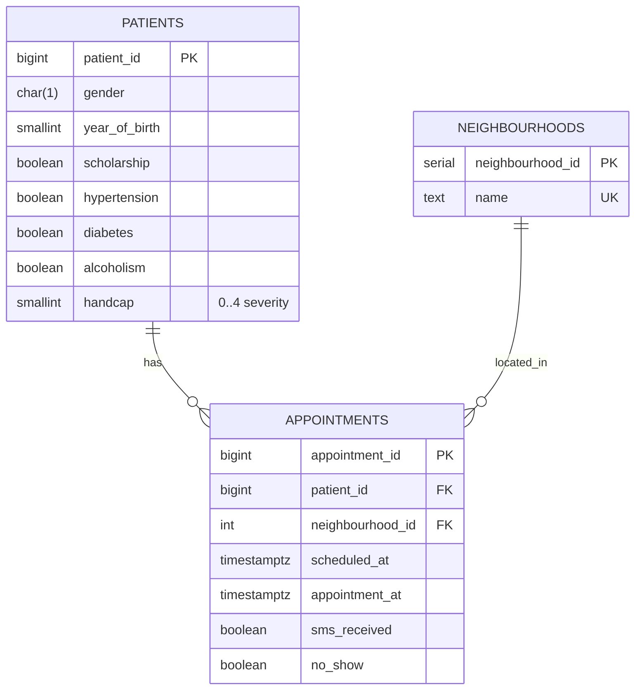
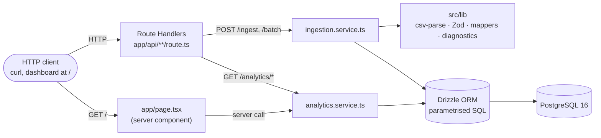

# Horatio Analytics

REST API that ingests the Kaggle *Medical Appointment No Shows* dataset (both
as a historical CSV and as JSON batches) and exposes analytics over no-show
behaviour by neighbourhood, gender and quarter.

Built for the Horatio Data Engineering take-home challenge.

---

## 1. Stack and rationale

| Layer | Choice | Why |
|---|---|---|
| Framework | **Next.js 15 (App Router)** | One deployable for API + future dashboard; Route Handlers are a thin REST surface with zero extra plumbing. *It is Next.js, not NestJS.* |
| Language | **TypeScript (`strict`)** | Type-safety from CSV row to SQL parameter. |
| Database | **PostgreSQL 16** | First-class window/aggregation functions for the analytics queries. |
| ORM / queries | **Drizzle ORM** | Schema-first migrations, fully-parametrised query builder, and the `sql` template tag for the two analytics queries — every query is parametrised, satisfying [RSPEC-2077](https://rules.sonarsource.com/typescript/RSPEC-2077/). |
| Validation | **Zod 4** | One schema drives runtime validation, derived TypeScript types, and the OpenAPI document (`z.toJSONSchema`). |
| CSV | **`csv-parse`** in streaming mode | The historical file has ~110k rows; streaming keeps memory flat. |
| Tests | **Vitest + Supertest-style fetch** | Same runtime as the app; serial integration suite shares one Postgres. |
| Containers | **Dockerfile + docker-compose** | Single-command local bring-up. |
| CI | **GitHub Actions** | Lint, typecheck and tests on every push to `main` or PR. |
| Logs | **`pino`** | Structured JSON logs without a runtime transport (clean for container stdout). |
| OpenAPI | **Zod-derived spec at `/api/openapi`** | Spec cannot drift from the validators. |

---

## 2. Data model

Three normalised tables:



Indexes on `appointments`:

- `(appointment_at)` — quick year/quarter scans
- `(patient_id)` — patient look-ups
- `(neighbourhood_id)` — joins to the lookup table
- `(appointment_at, no_show, neighbourhood_id)` — composite index sized for
  both analytics queries (year filter → no-show filter → group by neighbourhood)

### Transformations applied during ingestion

| Source column | Destination | Notes |
|---|---|---|
| `Age` + `AppointmentDay` | `year_of_birth` | Derived **once per patient**: `year(AppointmentDay) - Age`. Approximate ±1 year — documented and accepted. |
| `Hipertension` (CSV typo) | `hypertension` | Renamed. |
| `Handcap` | `handcap` (`smallint`) | Kept as severity `0..4`, **not** boolean. |
| `No-show` `"Yes"/"No"` | `no_show` (`boolean`) | `Yes ⇒ true`. |
| `Scholarship`, `Diabetes`, `Alcoholism`, `SMS_received` `0/1` | booleans | |
| `Neighbourhood` (string) | `neighbourhood_id` (FK) | Upsert by name, dedup via surrogate key. |
| `PatientId` (repeated per appointment) | `patients` row | Upsert; first row wins per `patient_id`. |

### Query plans

Both analytics queries run sub-millisecond against the committed `sample.csv`
(30 rows). The planner makes two different choices depending on selectivity
— shown by `EXPLAIN (ANALYZE, BUFFERS)`:

```text
GroupAggregate  (cost=50.89..51.18 rows=6 width=66) (actual time=0.116..0.136 rows=3)
   Group Key: n.name, p.gender
   ->  Sort
         Sort Key: n.name, p.gender
         ->  Nested Loop
               ->  Nested Loop
                     ->  Seq Scan on patients p
                     ->  Index Scan using appointments_patient_id_idx on appointments a
                           Index Cond: (patient_id = p.patient_id)
                           Filter: (no_show AND (EXTRACT(year FROM appointment_at) = '2016'))
               ->  Index Scan using neighbourhoods_pkey on neighbourhoods n
 Execution Time: 0.469 ms
```

```text
Sort  (actual time=0.191..0.193 rows=1)
   Sort Key: per_neighbourhood.no_shows DESC
   CTE per_neighbourhood
     ->  GroupAggregate
           Group Key: n.neighbourhood_id
           ->  Sort
                 ->  Nested Loop
                       ->  Seq Scan on appointments a
                             Filter: (no_show AND (EXTRACT(year FROM appointment_at) = '2016'))
                       ->  Index Scan using neighbourhoods_pkey on neighbourhoods n
   InitPlan 2 (returns AVG(no_shows))
     ->  Aggregate
           ->  CTE Scan on per_neighbourhood
 Execution Time: 0.379 ms
```

At sample scale the planner prefers a sequential scan of `appointments`
(only 12 no-show rows match the year filter). On the full Kaggle dataset
(~110 k rows, ~22 % no-show rate) the **composite
`(appointment_at, no_show, neighbourhood_id)` index** becomes the dominant
choice for the `WHERE appointment_at … AND no_show` access path — that is
the case the schema is sized for, and is why the index exists.

---

## 3. Architecture

A single Next.js process serves both the REST API and the data-quality
dashboard at `/`. Route Handlers are deliberately thin — they parse the
request boundary and delegate to a service. All business logic lives in
`src/services/`; all SQL goes through Drizzle, parametrised by construction.



Two ingestion paths funnel through the same `ingestion.service.ts`:

- **Streaming CSV** — `csv-parse` yields one record at a time; Zod validates
  each; valid rows accumulate into ~500-row chunks and each chunk commits in
  its own transaction. A bad row never blocks the chunk; a bad chunk never
  blocks the file.
- **JSON batch** — the whole payload runs in a single transaction; per-row
  failures (unknown `patient_id`, validation issues) surface as diagnostics
  without aborting the batch.

The dashboard reads analytics by calling the service **directly** (no
self-HTTP) — the same SQL as the public endpoints, just bypassing the
serialisation hop.

---

## 4. Endpoints

All endpoints return JSON. The full machine-readable spec is at
[`/api/openapi`](http://localhost:3000/api/openapi).

| Method | Path | Purpose |
|---|---|---|
| `GET` | `/api/health` | Liveness probe. |
| `POST` | `/api/ingest/historical` | Streaming CSV upload (`multipart/form-data`, field `file`). |
| `POST` | `/api/appointments/batch` | JSON batch of 1..1000 appointments. |
| `GET` | `/api/analytics/no-shows-by-quarter?year=YYYY` | Requirement 4.1. |
| `GET` | `/api/analytics/above-average-no-shows?year=YYYY` | Requirement 4.2. |
| `GET` | `/api/openapi` | OpenAPI 3.1 document. |

### Analysis year — default rule

When `?year` is omitted the API uses the **latest calendar year present in
`appointments`** (`EXTRACT(YEAR FROM MAX(appointment_at))`). If the fact table
is empty both analytics endpoints return `[]`.

### Dirty-row policy

Historical ingestion and batch insertion are **best-effort with row-level
diagnostics**. Valid rows are persisted; invalid ones are skipped and reported.

```jsonc
{
  "summary": { "received": 110527, "inserted": 110480, "skipped": 47 },
  "diagnostics": [
    { "row": 153, "field": "Gender", "value": "X", "error": "must be 'M' or 'F'" }
  ],
  "truncated": false
}
```

Diagnostics are capped at the first **1000** entries; the response carries
`"truncated": true` past that point.

### FK / transaction policy

- **Historical CSV** — neighbourhoods and patients are upserted before
  appointments. Each ~500-row chunk runs in its own transaction so a transient
  failure rolls back only the affected chunk, not the whole file.
- **Batch endpoint** — the entire batch runs in a single transaction.
  `patient_id` **must already exist**; non-existent patients yield a row-level
  diagnostic rather than a silent insert. `neighbourhood` is upserted by name.

### Idempotency

Both ingest endpoints are **idempotent on `appointment_id`** — appointments
are inserted with `ON CONFLICT DO NOTHING` on the primary key. Re-sending
the same payload after a network timeout is safe: the second call returns
`200` with `inserted: 0` and no new diagnostics. A client wanting to detect
a retry can compare `summary.received` to `summary.inserted` and check
that the diagnostics list is empty.

Patients are also upsert-on-conflict, and neighbourhoods upsert on
`name` — a duplicated CSV won't create ghost patients or duplicated
lookups.

---

## 5. Running locally

### Prerequisites

- Node.js 20+
- Docker + Docker Compose

### One-shot bring-up

```bash
docker compose up -d postgres        # start Postgres
cp .env.example .env.local           # set DATABASE_URL
npm ci
npm run db:migrate                   # apply Drizzle migrations
npm run dev                          # http://localhost:3000
```

### Loading data

A 30-row `data/sample.csv` is committed (25 valid rows + 5 intentionally
invalid rows to exercise the diagnostics path) so you can smoke-test the
pipeline without the Kaggle download:

```bash
curl -X POST http://localhost:3000/api/ingest/historical \
  -F "file=@data/sample.csv"
```

For the real dataset, download it from Kaggle to `data/appointments.csv`
(gitignored) and run:

```bash
curl -X POST http://localhost:3000/api/ingest/historical \
  -F "file=@data/appointments.csv"
```

### Running the whole stack in Docker

```bash
docker compose up --build
```

This builds the app image (multi-stage, Next.js standalone output) and starts
both `postgres` and `app` containers. Migrations still need to be applied once
from the host (`npm run db:migrate`) or by exec'ing into the app container.

### Troubleshooting

- **`password authentication failed for user "horatio"`** — a native
  PostgreSQL install is already bound to port 5432 and intercepts the
  connection before the container does. Drop a local
  `docker-compose.override.yml` (already gitignored) that re-maps the host
  port:

  ```yaml
  services:
    postgres:
      ports:
        - "5433:5432"
  ```

  Then update `DATABASE_URL` in `.env.local` to point to `:5433`.

- **`npm run db:migrate` appears to hang** — the spinner stays on screen
  if the public schema already contains the tables (e.g. someone applied
  the SQL manually). Drop the schema (`DROP SCHEMA public CASCADE; CREATE
  SCHEMA public;`) and rerun. On a fresh database the command completes
  in under a second.

---

## 6. Tests

```bash
npm test           # one-shot run
npm run test:watch # watch mode
```

- **Unit** — Zod schemas, CSV mappers, diagnostics collector, request-size
  guard.
- **Integration** — full ingestion + analytics pipelines against a real
  Postgres. The integration suite runs **serially** and shares one database;
  set `DATABASE_URL` to a disposable instance (the docker-compose `postgres`
  service is the intended target). Integration tests skip automatically when
  `DATABASE_URL` is not set.
- **Contract** — uses AJV to validate that each service's response shape
  matches the JSON Schema declared in `src/openapi.ts`. Catches drift
  between the OpenAPI document and runtime behaviour. DB-dependent contract
  cases skip with the same gate as the integration suite.

---

## 7. Project layout

```
.
├─ app/api/                  # Route handlers (thin — they delegate to services)
│  ├─ health/
│  ├─ ingest/historical/
│  ├─ appointments/batch/
│  ├─ analytics/no-shows-by-quarter/
│  ├─ analytics/above-average-no-shows/
│  └─ openapi/
├─ src/
│  ├─ db/                    # Drizzle schema, client, migrations
│  ├─ lib/                   # CSV streamer, Zod schemas, mappers, diagnostics, logger
│  ├─ services/              # Business logic (ingestion, analytics)
│  └─ openapi.ts             # OpenAPI 3.1 document
├─ tests/
│  ├─ unit/
│  ├─ integration/
│  └─ contract/              # AJV-driven response shape checks against the spec
├─ data/                     # CSV uploads (gitignored except a sample)
├─ docker-compose.yml
├─ Dockerfile
└─ .github/workflows/ci.yml
```

---

## 8. Design principles

- **Route handlers are thin.** Each handler parses the request boundary
  (multipart, JSON, query string) with Zod and delegates to a service. All
  business logic lives in `src/services/`.
- **Every SQL query is parametrised.** Drizzle's query builder and the `sql`
  template both bind values as parameters — no string concatenation anywhere
  (RSPEC-2077).
- **One source of truth for shapes.** Zod schemas drive runtime validation,
  TypeScript types (`z.infer`), and the OpenAPI document (`z.toJSONSchema`).

The load-bearing choices behind these principles have short Architecture
Decision Records under [`docs/decisions/`](./docs/decisions/) — one for
the framework, the ORM, the streaming/chunked-transaction strategy, and
the best-effort-with-diagnostics ingestion policy.

---

## 9. Security considerations

What the service does today, and what a production deployment would still
need.

**Already in place**

- **Parametrised SQL everywhere.** Drizzle's query builder and the `sql`
  template bind every value as a parameter — RSPEC-2077, no string-concat
  SQL anywhere in the codebase.
- **Edge validation.** Every request body — CSV row, batch payload, query
  string — goes through a Zod schema before reaching a service. Invalid
  input is rejected with a 4xx and a row-level diagnostic.
- **Request-size limits.** Ingestion routes inspect `Content-Length` and
  return `413 Payload Too Large` over the cap (200 MB for the historical
  CSV, 5 MB for batches). Limits live in `src/lib/security.ts`.
- **Defence-in-depth response headers.** A root `middleware.ts` sets
  `X-Content-Type-Options`, `X-Frame-Options`, `Referrer-Policy`, and HSTS
  (production only) on every response.
- **Container hardening.** The runtime image runs as a dedicated
  non-root `nextjs` user; the `DATABASE_URL` placeholder used during
  `next build` is discarded at the next `FROM` line and never reaches
  runtime.
- **Secrets stay out of the repo.** `.env*` is gitignored except for
  `.env.example`; the only credentials in the Dockerfile are
  build-only placeholders.

**Intentionally deferred for the take-home scope** (would ship before
exposing the API to anything other than `localhost`)

- **No authentication or authorisation.** Anyone reachable on
  `localhost:3000` can ingest, mutate, and read. Production would gate
  every route behind an API key or JWT and an RBAC layer at the route
  handler.
- **No rate limiting.** A reverse proxy (Nginx, Cloudflare) or a per-route
  middleware (e.g. `next-rate-limit`) would cap requests per IP and per
  token.
- **No audit log.** pino logs ingest summaries but not the caller
  identity; that requires the auth layer above to land first.
- **Raw values in diagnostics.** The `Diagnostic.value` field echoes the
  rejected field as-is. Synthetic dataset = no PII to leak, but on real
  data we would redact or hash.
- **No request body streaming size cap.** `Content-Length` is a
  best-effort signal — a malicious client can omit it. Production would
  enforce the cap inside the CSV stream parser as well.

---

## 10. Deployment

The Dockerfile produces a self-contained Next.js standalone server suitable for
any container host (Railway, Fly, Render, Vercel container deploy, GCP Cloud
Run, …). Set `DATABASE_URL` and the container will boot.

A live URL, if deployed, will be added at the top of this README.
